Bank EDA and Modeling
================
Me
4/20/2021

## I. Load libraries and the data

``` r
data = read_delim('bank.csv', delim = ';')
```

    ## 
    ## -- Column specification --------------------------------------------------------
    ## cols(
    ##   age = col_double(),
    ##   job = col_character(),
    ##   marital = col_character(),
    ##   education = col_character(),
    ##   default = col_character(),
    ##   balance = col_double(),
    ##   housing = col_character(),
    ##   loan = col_character(),
    ##   contact = col_character(),
    ##   day = col_double(),
    ##   month = col_character(),
    ##   duration = col_double(),
    ##   campaign = col_double(),
    ##   pdays = col_double(),
    ##   previous = col_double(),
    ##   poutcome = col_character(),
    ##   y = col_character()
    ## )

``` r
data %>%
        head() %>%
        kable()
```

| age | job         | marital | education | default | balance | housing | loan | contact  | day | month | duration | campaign | pdays | previous | poutcome | y   |
|----:|:------------|:--------|:----------|:--------|--------:|:--------|:-----|:---------|----:|:------|---------:|---------:|------:|---------:|:---------|:----|
|  30 | unemployed  | married | primary   | no      |    1787 | no      | no   | cellular |  19 | oct   |       79 |        1 |    -1 |        0 | unknown  | no  |
|  33 | services    | married | secondary | no      |    4789 | yes     | yes  | cellular |  11 | may   |      220 |        1 |   339 |        4 | failure  | no  |
|  35 | management  | single  | tertiary  | no      |    1350 | yes     | no   | cellular |  16 | apr   |      185 |        1 |   330 |        1 | failure  | no  |
|  30 | management  | married | tertiary  | no      |    1476 | yes     | yes  | unknown  |   3 | jun   |      199 |        4 |    -1 |        0 | unknown  | no  |
|  59 | blue-collar | married | secondary | no      |       0 | yes     | no   | unknown  |   5 | may   |      226 |        1 |    -1 |        0 | unknown  | no  |
|  35 | management  | single  | tertiary  | no      |     747 | no      | no   | cellular |  23 | feb   |      141 |        2 |   176 |        3 | failure  | no  |

## II. Exploratory data Analysis

### Check data type and content

``` r
df_status(data)
```

    ##     variable q_zeros p_zeros q_na p_na q_inf p_inf      type unique
    ## 1        age       0    0.00    0    0     0     0   numeric     67
    ## 2        job       0    0.00    0    0     0     0 character     12
    ## 3    marital       0    0.00    0    0     0     0 character      3
    ## 4  education       0    0.00    0    0     0     0 character      4
    ## 5    default       0    0.00    0    0     0     0 character      2
    ## 6    balance     357    7.90    0    0     0     0   numeric   2353
    ## 7    housing       0    0.00    0    0     0     0 character      2
    ## 8       loan       0    0.00    0    0     0     0 character      2
    ## 9    contact       0    0.00    0    0     0     0 character      3
    ## 10       day       0    0.00    0    0     0     0   numeric     31
    ## 11     month       0    0.00    0    0     0     0 character     12
    ## 12  duration       0    0.00    0    0     0     0   numeric    875
    ## 13  campaign       0    0.00    0    0     0     0   numeric     32
    ## 14     pdays       0    0.00    0    0     0     0   numeric    292
    ## 15  previous    3705   81.95    0    0     0     0   numeric     24
    ## 16  poutcome       0    0.00    0    0     0     0 character      4
    ## 17         y       0    0.00    0    0     0     0 character      2

There are no missing values

Check the response variable

``` r
table(data$y)/nrow(data)
```

    ## 
    ##      no     yes 
    ## 0.88476 0.11524

There are fewer yes on term deposit. Sampling method is needed on
splitting train and test

### Check numeric data

``` r
plot1 = inspect_num(data) %>%
        show_plot()+
        theme_minimal()
ggplotly(plot1)
```

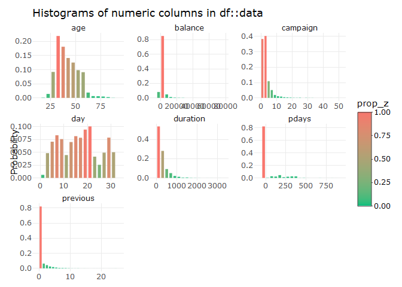<!-- -->

Most numeric characters are skewed. Based on the attribute information,
the columns duration, campaign, pdays, and previous are based on the
customer contacts. Probably better to leave this columns as is.

Try to transform balance column since this is probably log-normally
distributed. There will be removed observations because of negative and
0 values.

``` r
plot2 = data %>%
        ggplot(aes(balance))+
        geom_histogram(fill = 'steelblue')+
        scale_x_log10(label = comma)+
        labs(y = '', x = 'Log balance', title = 'Log distribution of balance')+
        theme_minimal()

ggplotly(plot2)
```

    ## `stat_bin()` using `bins = 30`. Pick better value with `binwidth`.

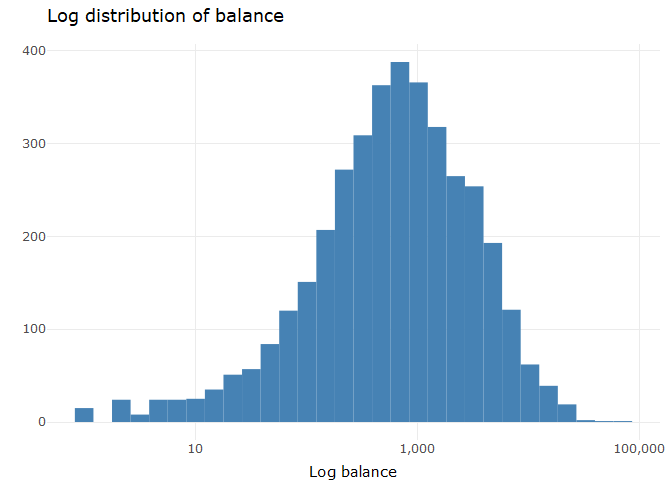<!-- -->

Check if there are still outliers after log transformation

``` r
outliers_balance = boxplot(log(data$balance), plot = FALSE)$out

data %>%
        filter(log(balance) %in% outliers_balance, balance > 100) %>%
        kable()
```

| age | job     | marital | education | default | balance | housing | loan | contact  | day | month | duration | campaign | pdays | previous | poutcome | y   |
|----:|:--------|:--------|:----------|:--------|--------:|:--------|:-----|:---------|----:|:------|---------:|---------:|------:|---------:|:---------|:----|
|  60 | retired | married | primary   | no      |   71188 | no      | no   | cellular |   6 | oct   |      205 |        1 |    -1 |        0 | unknown  | no  |

``` r
quantile(data$balance)
```

    ##    0%   25%   50%   75%  100% 
    ## -3313    69   444  1480 71188

It would be better to remove this entry since this might affect the
model

``` r
corr = data %>%
        select_if(is.numeric) %>%
        cor()

corrplot(corr, method = 'number')
```

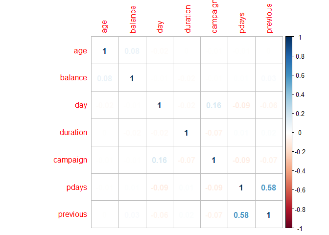<!-- -->

The fields previous and pdays are highly correlated because both are
related to campaign contacts. Values on both of these fields are also
dependent.

### Check categorical data

Check frequency of categorical data

``` r
inspect_cat(data) %>%
        show_plot()
```

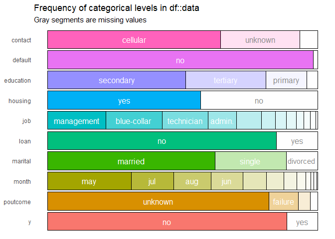<!-- -->

Plot first three demographic data related to bank client

``` r
plot3 = data %>%
        ggplot(aes(x = job, fill =  education))+
        geom_bar(position =  'fill')+
        coord_flip()+
        facet_grid(~marital)+
        labs(y = 'proportions', x= '', title = 'Job by marital status and education')+
        scale_y_continuous(breaks = seq(0, 1, .2), 
                     label = percent)+
        scale_fill_brewer(palette = 'GnBu')+
        theme_minimal()+
        theme(legend.position = 'bottom')

ggplotly(plot3)
```

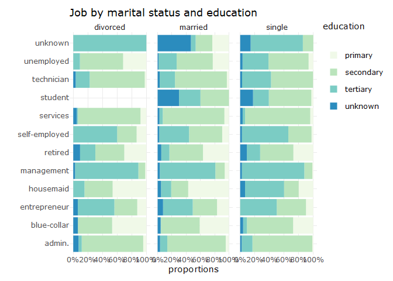<!-- -->

Some insights on this graph

-   There is no divorced student in our dataset. All divorced with
    unknown job have tertiary education. Entrepreneur and retired is
    diverse.

-   We can see here the distribution of education and marital status per
    job. Most management jobs have tertiary level of education whereas
    the services and admin are dominantly secondary education regardless
    of your marital status.

Plot the other three bank client data, housing loan, personal loan, and
default

``` r
plot4 = data %>%
        ggplot(aes(default, fill = loan))+
        geom_bar(position = 'fill', alpha = .7)+
        scale_y_continuous(breaks = seq(0, 1, .2), 
                     label = percent) +
        scale_fill_manual(values = c('yes' = 'tomato', 'no' = 'gray', guide = F))+
        labs(x=  'Credit card defaulted', fill = 'Personal Loan',
             title = 'Percentage of individuals with personal loan by credit card default')+
        theme(legend.position = 'top')+
        theme_minimal()

plot4
```

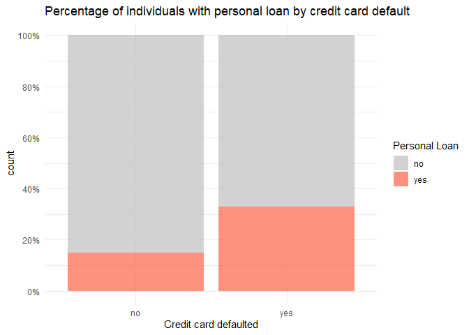<!-- -->

``` r
plot5 = data %>%
        ggplot(aes(default, fill = housing))+
        geom_bar(position = 'fill', alpha = .7)+
        scale_y_continuous(breaks = seq(0, 1, .2), 
                     label = percent) +
        scale_fill_manual(values = c('yes' = 'tomato', 'no' = 'gray', guide = F))+
        labs(x=  'Credit card has default', fill = 'Housing loan',
             title = 'Percentage of individuals with housing loan by credit card default')+
        theme_minimal()

plot5
```

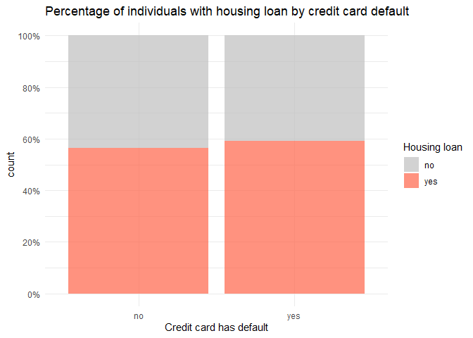<!-- -->

Unlike the first graph, the proportion of individuals with a housing
loan is the same whether they have a default credit. This is probably
because housing loan is normally taken by anyone. The variable personal
loan would be a better predictor whether a person will default compared
to housing loan field.

### Possible questions the bank might be interested in

#### 1. Is the previous marketing campaign a good indicator whether a client will get a term deposit?

``` r
plot6 = data %>%
        group_by(poutcome, y) %>%
        count() %>%
        group_by(y) %>%
        mutate(percentage = n/ sum(n)) %>%
        ggplot(aes(reorder(poutcome, percentage), percentage, fill = y))+
        geom_col(position = 'dodge', alpha = .7)+
        scale_fill_manual(values = c('yes' = 'tomato', 'no' = 'gray', guide = F))+
        labs(x = 'Previous campaign outcome', y = 'Percentage', fill = 'W/ term deposit',
             title = 'Outcome of previous campaign and term deposit')+
        theme_minimal()+
        coord_flip()

plot6
```

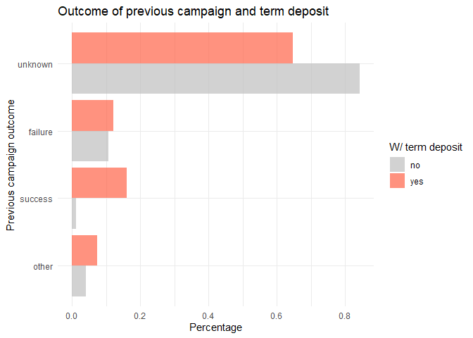<!-- -->

#### 2. What is the balance distribution of clients with and without term deposit?

``` r
plot8 = data %>%
        ggplot(aes(balance,  fill = y, color = y))+
        geom_density(alpha = .3)+
        scale_x_log10(labels = comma)+
        scale_fill_manual(values = c('yes' = 'tomato', 'no' = 'gray'))+
        scale_color_manual(values = c('yes' = 'tomato', 'no' = 'gray'), guide = F)+
        labs(title = 'Balance distribution by obtained term deposit', x = 'Log balance', fill = 'W/ term deposit')+
        theme_minimal()

plot8
```

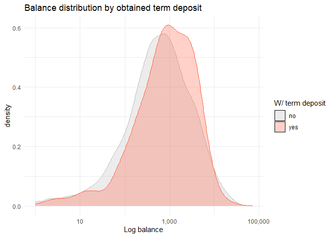<!-- -->

The peak of clients with term deposit is slightly to the right implying
those who get term deposit have higher balance.

#### 3. What jobs are more likely to get a personal loan?

``` r
plot9=  data %>%
        group_by(job, loan) %>%
        count() %>%
        group_by(loan) %>%
        mutate(percentage = n/ sum(n)) %>%
        mutate(highlight = ifelse((job %in% c('blue-collar','admin.','services','entrepreneur')),'yes','no')) %>%
        ggplot(aes(reorder(job, percentage), percentage, fill = loan))+
        geom_col(position = 'dodge', aes(alpha = highlight))+
        scale_alpha_manual(values = c('yes' = 1, 'no' = .4), guide = F)+
        scale_fill_manual(values = c('yes' = 'tomato', 'no' = 'gray'))+
        labs(x = '', y = 'Percentage', fill = 'Has loan',
             title = 'Percentage of clients with personal loan by job')+
        theme(legend.position = 'none')+
        theme_minimal()+
        coord_flip()
        
plot9
```

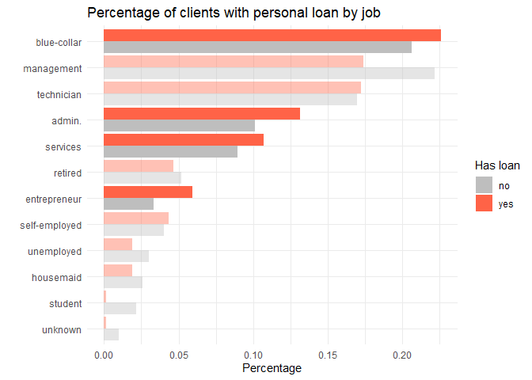<!-- -->

Blue collar job, admin, services, and entrepreneur jobs are more likely
to get a personal loan.

#### 4. How does a client’s education affect their balance?

Note: Observations with balance less than 5000 only

``` r
plot10 = data %>%
        filter(balance < 5000) %>%
        group_by(education) %>%
        mutate(median_balance = median(balance)) %>%
        ggplot(aes(balance))+
        geom_histogram(binwidth = 250, fill = 'steelblue')+
        geom_vline(aes(xintercept = median_balance), color = 'black', linetype = 'dashed')+
        theme_minimal()+
        facet_grid(education ~ .)+
        labs(title = 'Distribution of balance by education', y = '', x = 'balance', caption = 'Black dashed line is median')

ggplotly(plot10)
```

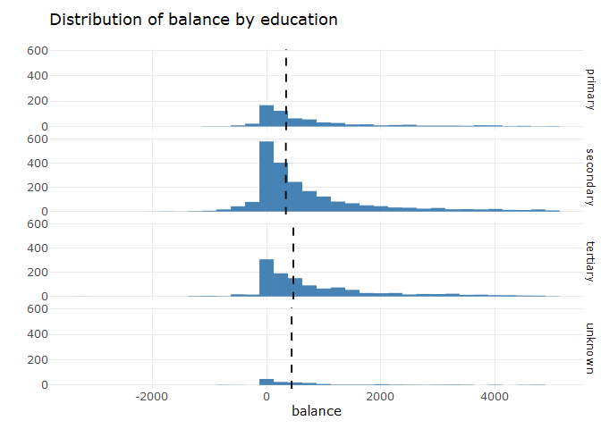<!-- -->

Almost same shape (right tailed) with tertiary level of education having
the highest median and max. Primary and secondary levels of education
also have higher occurrences of negative balance

### 5. Does age affect a client’s balance?

Note: Balance &gt; 0. Removed around 700 observations

``` r
plot11 = data %>%
        filter(balance > 0) %>%
        ggplot(aes(age, balance))+
        geom_point(alpha = .7, aes(color = y))+
        scale_y_log10(label = comma)+
        geom_smooth(color = 'black', size = 1.2, alpha = .8)+
        labs(x = 'age', y = 'Log balance', title = 'Age vs Log balance', color = 'Term deposit')+
        scale_color_manual(values = c('yes' = 'tomato', 'no' = 'gray', guide = F))+
        theme_minimal()

ggplotly(plot11)
```

    ## `geom_smooth()` using method = 'gam' and formula 'y ~ s(x, bs = "cs")'

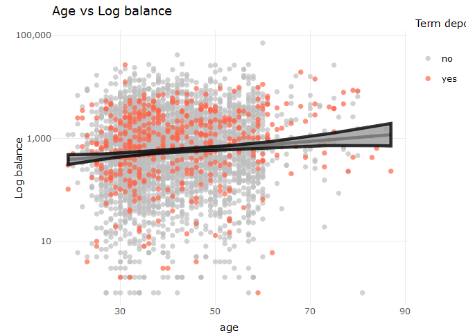<!-- -->

There is a slightly increasing trend which is more noticeable on higher
age groups. Also most on the bottom points did not avail term deposit.

#### 6. Does the contact duration affect whether the client will get a term deposit?

``` r
plot12 = data %>%
        ggplot(aes(x = as.factor(y), y = duration, fill = y))+
        geom_violin(width = 1.4, alpha = .7)+
        stat_summary(fun = median, geom = 'point', shape = 22 , size = 2)+
        scale_fill_manual(values = c('yes' = 'tomato', 'no' = 'gray'))+
        labs(x = 'W/ term deposit', y=  'contact duration', title = 'Contact duration distribution by term deposit',
             caption = 'Violin plot with median (square)')+
        theme_minimal()+
        theme(legend.position = 'none')
       
ggplotly(plot12)
```

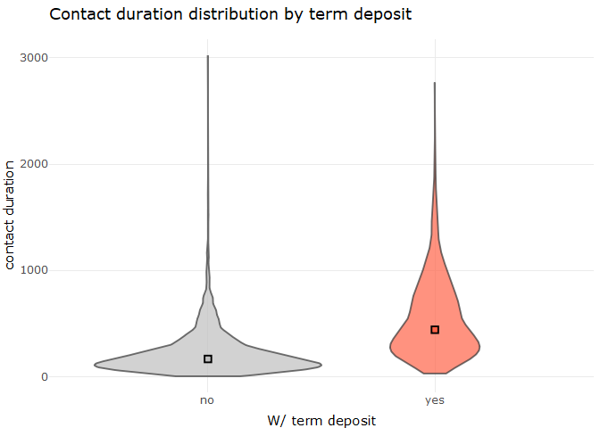<!-- -->

From the data, those who get a term deposit has higher contact duration.

## III Modeling

### Change data type

Change character into factors

``` r
data = data %>%
  mutate_if(is.character, as.factor)

glimpse(data)
```

    ## Rows: 4,521
    ## Columns: 17
    ## $ age       <dbl> 30, 33, 35, 30, 59, 35, 36, 39, 41, 43, 39, 43, 36, 20, 3...
    ## $ job       <fct> unemployed, services, management, management, blue-collar...
    ## $ marital   <fct> married, married, single, married, married, single, marri...
    ## $ education <fct> primary, secondary, tertiary, tertiary, secondary, tertia...
    ## $ default   <fct> no, no, no, no, no, no, no, no, no, no, no, no, no, no, n...
    ## $ balance   <dbl> 1787, 4789, 1350, 1476, 0, 747, 307, 147, 221, -88, 9374,...
    ## $ housing   <fct> no, yes, yes, yes, yes, no, yes, yes, yes, yes, yes, yes,...
    ## $ loan      <fct> no, yes, no, yes, no, no, no, no, no, yes, no, no, no, no...
    ## $ contact   <fct> cellular, cellular, cellular, unknown, unknown, cellular,...
    ## $ day       <dbl> 19, 11, 16, 3, 5, 23, 14, 6, 14, 17, 20, 17, 13, 30, 29, ...
    ## $ month     <fct> oct, may, apr, jun, may, feb, may, may, may, apr, may, ap...
    ## $ duration  <dbl> 79, 220, 185, 199, 226, 141, 341, 151, 57, 313, 273, 113,...
    ## $ campaign  <dbl> 1, 1, 1, 4, 1, 2, 1, 2, 2, 1, 1, 2, 2, 1, 1, 2, 5, 1, 1, ...
    ## $ pdays     <dbl> -1, 339, 330, -1, -1, 176, 330, -1, -1, 147, -1, -1, -1, ...
    ## $ previous  <dbl> 0, 4, 1, 0, 0, 3, 2, 0, 0, 2, 0, 0, 0, 0, 1, 0, 0, 2, 0, ...
    ## $ poutcome  <fct> unknown, failure, failure, unknown, unknown, failure, oth...
    ## $ y         <fct> no, no, no, no, no, no, no, no, no, no, no, no, no, yes, ...

### Remove/Add/ Change data

Identify variables with near zero variance

``` r
nz = nearZeroVar(data)
colnames(data[,nz])
```

    ## [1] "default" "pdays"

We can remove variables default and pdays since they don’t have strong
predicting powers. Also pdays is highly correlated with previous.

Remove these columns and remove the outlier

``` r
data = data %>%
  filter(!balance == max(balance))

data = data[,-nz]
```

### Split train and test set

80% training and 20% test. Split the sample on response variable y so
that test and train set will have the same proportion of y

``` r
in_train  = createDataPartition(data$y, p = .8, list = F)
train_data = data[in_train,]
test_data = data[-in_train,]
```

Create train with down sample and upsample to balance response variable

``` r
#834 rows
train_data_down = downSample(x = train_data %>%
                        select(-y),
                   y = train_data$y,
                   yname = 'y')

#6400 rows
train_data_up = upSample(x = train_data %>%
                        select(-y),
                   y = train_data$y,
                   yname = 'y')

table(train_data_down$y)/nrow(train_data_down)
```

    ## 
    ##  no yes 
    ## 0.5 0.5

### Model Building

#### Model setup

Set up train control for resampling.

-   Kfold cross validation
-   10 folds
-   Compute for class probability
-   Multiclass summary function to include AUC aside from accuracy,
    sensitivity, and specificity in resampling computation.

``` r
train_control = trainControl(method = 'cv', number = 10, classProbs =T, summaryFunction = multiClassSummary)
```

Setup parallel computing

``` r
library(doParallel)
cores = detectCores()
cl = makeCluster(cores[1]-1)
#Register cluster
registerDoParallel(cl)
```

#### Logistic regression model

``` r
set.seed(100)
glm_model = train(y ~., data = train_data_down, method = 'glm', family = 'binomial', trControl = train_control)
glm_model
```

    ## Generalized Linear Model 
    ## 
    ## 834 samples
    ##  14 predictor
    ##   2 classes: 'no', 'yes' 
    ## 
    ## No pre-processing
    ## Resampling: Cross-Validated (10 fold) 
    ## Summary of sample sizes: 750, 751, 751, 750, 751, 751, ... 
    ## Resampling results:
    ## 
    ##   logLoss    AUC        prAUC     Accuracy  Kappa      F1         Sensitivity
    ##   0.4664417  0.8878782  0.861383  0.805809  0.6116376  0.8115047  0.8342625  
    ##   Specificity  Pos_Pred_Value  Neg_Pred_Value  Precision  Recall   
    ##   0.7774681    0.7929834       0.8253516       0.7929834  0.8342625
    ##   Detection_Rate  Balanced_Accuracy
    ##   0.417226        0.8058653

Predict using glm model

``` r
glm_preds = predict(glm_model, test_data)
confusionMatrix(glm_preds, test_data$y, positive = 'yes')
```

    ## Confusion Matrix and Statistics
    ## 
    ##           Reference
    ## Prediction  no yes
    ##        no  665  22
    ##        yes 134  82
    ##                                          
    ##                Accuracy : 0.8272         
    ##                  95% CI : (0.801, 0.8514)
    ##     No Information Rate : 0.8848         
    ##     P-Value [Acc > NIR] : 1              
    ##                                          
    ##                   Kappa : 0.4227         
    ##                                          
    ##  Mcnemar's Test P-Value : <2e-16         
    ##                                          
    ##             Sensitivity : 0.78846        
    ##             Specificity : 0.83229        
    ##          Pos Pred Value : 0.37963        
    ##          Neg Pred Value : 0.96798        
    ##              Prevalence : 0.11517        
    ##          Detection Rate : 0.09081        
    ##    Detection Prevalence : 0.23920        
    ##       Balanced Accuracy : 0.81038        
    ##                                          
    ##        'Positive' Class : yes            
    ## 

This model has high accuracy but low positive predictive value. There
were a lot of predicted yes as compared to actual yes. In real life this
would incur additional cost if we predict a client to get a term deposit
even though the client would not. But if there’s a budget, this might be
acceptable

Train using the same model but with the upsampled train data

``` r
set.seed(100)
glm_model_up = train(y ~., data = train_data_up, method = 'glm', family = 'binomial', trControl = train_control)
glm_model_up
```

    ## Generalized Linear Model 
    ## 
    ## 6400 samples
    ##   14 predictor
    ##    2 classes: 'no', 'yes' 
    ## 
    ## No pre-processing
    ## Resampling: Cross-Validated (10 fold) 
    ## Summary of sample sizes: 5760, 5760, 5760, 5760, 5760, 5760, ... 
    ## Resampling results:
    ## 
    ##   logLoss    AUC        prAUC     Accuracy  Kappa  F1         Sensitivity
    ##   0.4104586  0.9038125  0.894704  0.835     0.67   0.8359294  0.8403125  
    ##   Specificity  Pos_Pred_Value  Neg_Pred_Value  Precision  Recall   
    ##   0.8296875    0.8322351       0.8389126       0.8322351  0.8403125
    ##   Detection_Rate  Balanced_Accuracy
    ##   0.4201563       0.835

``` r
glm_model_up_pred = predict(glm_model_up, test_data)
confusionMatrix(glm_model_up_pred, test_data$y, positive = 'yes')
```

    ## Confusion Matrix and Statistics
    ## 
    ##           Reference
    ## Prediction  no yes
    ##        no  678  23
    ##        yes 121  81
    ##                                          
    ##                Accuracy : 0.8405         
    ##                  95% CI : (0.815, 0.8638)
    ##     No Information Rate : 0.8848         
    ##     P-Value [Acc > NIR] : 1              
    ##                                          
    ##                   Kappa : 0.445          
    ##                                          
    ##  Mcnemar's Test P-Value : 6.302e-16      
    ##                                          
    ##             Sensitivity : 0.7788         
    ##             Specificity : 0.8486         
    ##          Pos Pred Value : 0.4010         
    ##          Neg Pred Value : 0.9672         
    ##              Prevalence : 0.1152         
    ##          Detection Rate : 0.0897         
    ##    Detection Prevalence : 0.2237         
    ##       Balanced Accuracy : 0.8137         
    ##                                          
    ##        'Positive' Class : yes            
    ## 

It seems that the model with upsampled sample is slightly more accurate
but still have low positive predictive value.

One advantage of using simpler model such as logistic regression is that
you can check the estimate and significance of each variable

``` r
summary(glm_model_up)
```

    ## 
    ## Call:
    ## NULL
    ## 
    ## Deviance Residuals: 
    ##     Min       1Q   Median       3Q      Max  
    ## -5.2095  -0.5878  -0.0078   0.6333   2.1087  
    ## 
    ## Coefficients:
    ##                      Estimate Std. Error z value Pr(>|z|)    
    ## (Intercept)        -1.091e+00  3.494e-01  -3.124 0.001784 ** 
    ## age                 2.465e-03  4.453e-03   0.554 0.579872    
    ## `jobblue-collar`   -6.421e-01  1.395e-01  -4.604 4.15e-06 ***
    ## jobentrepreneur    -1.097e+00  2.509e-01  -4.371 1.23e-05 ***
    ## jobhousemaid       -5.545e-01  2.442e-01  -2.271 0.023150 *  
    ## jobmanagement      -2.489e-01  1.450e-01  -1.717 0.086054 .  
    ## jobretired          5.453e-01  1.893e-01   2.880 0.003978 ** 
    ## `jobself-employed` -7.691e-01  2.303e-01  -3.339 0.000840 ***
    ## jobservices        -6.514e-01  1.688e-01  -3.860 0.000114 ***
    ## jobstudent          3.767e-01  2.530e-01   1.489 0.136524    
    ## jobtechnician      -5.315e-01  1.349e-01  -3.940 8.16e-05 ***
    ## jobunemployed      -1.238e+00  2.711e-01  -4.567 4.95e-06 ***
    ## jobunknown          5.356e-01  3.571e-01   1.500 0.133665    
    ## maritalmarried     -2.017e-01  1.128e-01  -1.787 0.073861 .  
    ## maritalsingle       1.267e-01  1.319e-01   0.961 0.336679    
    ## educationsecondary  3.299e-01  1.238e-01   2.665 0.007710 ** 
    ## educationtertiary   3.439e-01  1.434e-01   2.398 0.016495 *  
    ## educationunknown   -4.340e-01  2.147e-01  -2.022 0.043196 *  
    ## balance             1.324e-05  1.268e-05   1.045 0.296130    
    ## housingyes         -3.087e-01  8.255e-02  -3.740 0.000184 ***
    ## loanyes            -9.348e-01  1.179e-01  -7.929 2.21e-15 ***
    ## contacttelephone    1.499e-01  1.398e-01   1.073 0.283492    
    ## contactunknown     -1.193e+00  1.238e-01  -9.638  < 2e-16 ***
    ## day                 1.660e-02  4.943e-03   3.359 0.000782 ***
    ## monthaug           -2.503e-01  1.509e-01  -1.659 0.097075 .  
    ## monthdec            4.486e-01  4.867e-01   0.922 0.356703    
    ## monthfeb            3.615e-01  1.783e-01   2.028 0.042548 *  
    ## monthjan           -1.394e+00  2.281e-01  -6.108 1.01e-09 ***
    ## monthjul           -6.863e-01  1.552e-01  -4.422 9.76e-06 ***
    ## monthjun            4.302e-01  1.840e-01   2.338 0.019405 *  
    ## monthmar            1.844e+00  2.834e-01   6.508 7.62e-11 ***
    ## monthmay           -7.369e-01  1.474e-01  -4.999 5.78e-07 ***
    ## monthnov           -6.714e-01  1.657e-01  -4.051 5.10e-05 ***
    ## monthoct            2.061e+00  2.665e-01   7.737 1.02e-14 ***
    ## monthsep            7.689e-01  2.948e-01   2.608 0.009099 ** 
    ## duration            5.816e-03  1.702e-04  34.171  < 2e-16 ***
    ## campaign           -1.131e-01  1.713e-02  -6.602 4.05e-11 ***
    ## previous           -4.608e-02  2.757e-02  -1.671 0.094661 .  
    ## poutcomeother       8.132e-01  1.699e-01   4.785 1.71e-06 ***
    ## poutcomesuccess     2.596e+00  2.171e-01  11.957  < 2e-16 ***
    ## poutcomeunknown    -5.169e-01  1.321e-01  -3.914 9.08e-05 ***
    ## ---
    ## Signif. codes:  0 '***' 0.001 '**' 0.01 '*' 0.05 '.' 0.1 ' ' 1
    ## 
    ## (Dispersion parameter for binomial family taken to be 1)
    ## 
    ##     Null deviance: 8872.3  on 6399  degrees of freedom
    ## Residual deviance: 5153.4  on 6359  degrees of freedom
    ## AIC: 5235.4
    ## 
    ## Number of Fisher Scoring iterations: 6

Sample significant variables

-   poutcomesuccess : positive
-   duration : positive
-   unknown contact : negative
-   loanyes : negative

#### Random forest

Try a more complex model with tuning parameters to increase model
accuracy.

``` r
set.seed(100)

#set up tuning grid parameter
# 2,3,4 different mtry
tunegrid = expand.grid(.mtry=c(2:8))

rf_model = train(y ~., data = train_data_up, method = 'rf', tuneGrid = tunegrid, trControl = train_control)
rf_model
```

    ## Random Forest 
    ## 
    ## 6400 samples
    ##   14 predictor
    ##    2 classes: 'no', 'yes' 
    ## 
    ## No pre-processing
    ## Resampling: Cross-Validated (10 fold) 
    ## Summary of sample sizes: 5760, 5760, 5760, 5760, 5760, 5760, ... 
    ## Resampling results across tuning parameters:
    ## 
    ##   mtry  logLoss     AUC        prAUC      Accuracy   Kappa      F1       
    ##   2     0.33438093  0.9585596  0.9526315  0.8940625  0.7881250  0.8921045
    ##   3     0.22002440  0.9921050  0.9846361  0.9446875  0.8893750  0.9425111
    ##   4     0.15421527  0.9985005  0.9827493  0.9607813  0.9215625  0.9592620
    ##   5     0.11943944  0.9995176  0.9673380  0.9682812  0.9365625  0.9672099
    ##   6     0.10064988  0.9996992  0.9390796  0.9714063  0.9428125  0.9705692
    ##   7     0.09004233  0.9997402  0.8977140  0.9734375  0.9468750  0.9726983
    ##   8     0.08455449  0.9997969  0.8573015  0.9721875  0.9443750  0.9713736
    ##   Sensitivity  Specificity  Pos_Pred_Value  Neg_Pred_Value  Precision
    ##   0.8759375    0.9121875    0.9090720       0.8804033       0.9090720
    ##   0.9071875    0.9821875    0.9808995       0.9138115       0.9808995
    ##   0.9246875    0.9968750    0.9966776       0.9299293       0.9966776
    ##   0.9371875    0.9993750    0.9993506       0.9410371       0.9993506
    ##   0.9434375    0.9993750    0.9993485       0.9464857       0.9993485
    ##   0.9475000    0.9993750    0.9993506       0.9501966       0.9993506
    ##   0.9450000    0.9993750    0.9993548       0.9479617       0.9993548
    ##   Recall     Detection_Rate  Balanced_Accuracy
    ##   0.8759375  0.4379688       0.8940625        
    ##   0.9071875  0.4535938       0.9446875        
    ##   0.9246875  0.4623437       0.9607812        
    ##   0.9371875  0.4685937       0.9682812        
    ##   0.9434375  0.4717187       0.9714063        
    ##   0.9475000  0.4737500       0.9734375        
    ##   0.9450000  0.4725000       0.9721875        
    ## 
    ## Accuracy was used to select the optimal model using the largest value.
    ## The final value used for the model was mtry = 7.

``` r
rf_model_pred = predict(rf_model, test_data)
confusionMatrix(rf_model_pred, test_data$y, positive = 'yes')
```

    ## Confusion Matrix and Statistics
    ## 
    ##           Reference
    ## Prediction  no yes
    ##        no  765  59
    ##        yes  34  45
    ##                                           
    ##                Accuracy : 0.897           
    ##                  95% CI : (0.8753, 0.9161)
    ##     No Information Rate : 0.8848          
    ##     P-Value [Acc > NIR] : 0.13618         
    ##                                           
    ##                   Kappa : 0.4357          
    ##                                           
    ##  Mcnemar's Test P-Value : 0.01282         
    ##                                           
    ##             Sensitivity : 0.43269         
    ##             Specificity : 0.95745         
    ##          Pos Pred Value : 0.56962         
    ##          Neg Pred Value : 0.92840         
    ##              Prevalence : 0.11517         
    ##          Detection Rate : 0.04983         
    ##    Detection Prevalence : 0.08749         
    ##       Balanced Accuracy : 0.69507         
    ##                                           
    ##        'Positive' Class : yes             
    ## 

This model has higher accuracy but lower sensitivity in prediction. The
model also overfitted in predicting yes. Probably because training data
is balanced whereas test data is not. This model, however, has higher
specificity and lower logloss and accurately predicts those that are
TRUE NEGATIVE better.

Use random forest on downsampled data.

``` r
set.seed(100)

#set up tuning grid parameter
# 2,3,4 different mtry
tunegrid = expand.grid(.mtry=c(2:8))

rf_model_down = train(y ~., data = train_data_down, method = 'rf', tuneGrid = tunegrid, trControl = train_control)
rf_model_down
```

    ## Random Forest 
    ## 
    ## 834 samples
    ##  14 predictor
    ##   2 classes: 'no', 'yes' 
    ## 
    ## No pre-processing
    ## Resampling: Cross-Validated (10 fold) 
    ## Summary of sample sizes: 750, 751, 751, 750, 751, 751, ... 
    ## Resampling results across tuning parameters:
    ## 
    ##   mtry  logLoss    AUC        prAUC      Accuracy   Kappa      F1       
    ##   2     0.4901631  0.8705450  0.8448708  0.7746414  0.5495702  0.7855205
    ##   3     0.4545002  0.8936653  0.8687724  0.8225760  0.6453581  0.8222396
    ##   4     0.4398068  0.8998590  0.8724622  0.8321859  0.6645310  0.8295765
    ##   5     0.4287004  0.9029893  0.8746135  0.8285571  0.6572342  0.8250698
    ##   6     0.4192053  0.9032334  0.8747852  0.8261905  0.6524825  0.8226920
    ##   7     0.4142528  0.9039157  0.8781594  0.8237952  0.6476838  0.8195099
    ##   8     0.4090408  0.9056627  0.8806163  0.8249713  0.6500379  0.8209143
    ##   Sensitivity  Specificity  Pos_Pred_Value  Neg_Pred_Value  Precision
    ##   0.8274681    0.7223577    0.7506155       0.8097676       0.7506155
    ##   0.8203833    0.8253775    0.8270035       0.8220755       0.8270035
    ##   0.8179443    0.8469803    0.8440789       0.8241764       0.8440789
    ##   0.8081882    0.8493612    0.8447881       0.8161669       0.8447881
    ##   0.8081882    0.8445412    0.8399194       0.8161123       0.8399194
    ##   0.8009872    0.8469222    0.8407716       0.8104992       0.8407716
    ##   0.8033682    0.8469222    0.8407026       0.8122611       0.8407026
    ##   Recall     Detection_Rate  Balanced_Accuracy
    ##   0.8274681  0.4136833       0.7749129        
    ##   0.8203833  0.4100832       0.8228804        
    ##   0.8179443  0.4088640       0.8324623        
    ##   0.8081882  0.4040448       0.8287747        
    ##   0.8081882  0.4040591       0.8263647        
    ##   0.8009872  0.4004733       0.8239547        
    ##   0.8033682  0.4016638       0.8251452        
    ## 
    ## Accuracy was used to select the optimal model using the largest value.
    ## The final value used for the model was mtry = 4.

``` r
rf_model_pred_down = predict(rf_model_down, test_data)
confusionMatrix(rf_model_pred_down, test_data$y, positive = 'yes')
```

    ## Confusion Matrix and Statistics
    ## 
    ##           Reference
    ## Prediction  no yes
    ##        no  641  19
    ##        yes 158  85
    ##                                           
    ##                Accuracy : 0.804           
    ##                  95% CI : (0.7766, 0.8294)
    ##     No Information Rate : 0.8848          
    ##     P-Value [Acc > NIR] : 1               
    ##                                           
    ##                   Kappa : 0.3918          
    ##                                           
    ##  Mcnemar's Test P-Value : <2e-16          
    ##                                           
    ##             Sensitivity : 0.81731         
    ##             Specificity : 0.80225         
    ##          Pos Pred Value : 0.34979         
    ##          Neg Pred Value : 0.97121         
    ##              Prevalence : 0.11517         
    ##          Detection Rate : 0.09413         
    ##    Detection Prevalence : 0.26910         
    ##       Balanced Accuracy : 0.80978         
    ##                                           
    ##        'Positive' Class : yes             
    ## 

Now this model has higher sensitivity but overall lower accuracy. Random
forest model is less robust compared to GLM and is more affected by the
sampling method on the training data.

#### Support Vector Machine

``` r
#model setup
set.seed(100)
svm_grid = expand.grid(C = seq(0, 2, length = 10))

# fit model
svm_model = train(y ~., data = train_data_up, method = 'svmLinear', tuneGrid = svm_grid, trControl = train_control)
svm_model
```

    ## Support Vector Machines with Linear Kernel 
    ## 
    ## 6400 samples
    ##   14 predictor
    ##    2 classes: 'no', 'yes' 
    ## 
    ## No pre-processing
    ## Resampling: Cross-Validated (10 fold) 
    ## Summary of sample sizes: 5760, 5760, 5760, 5760, 5760, 5760, ... 
    ## Resampling results across tuning parameters:
    ## 
    ##   C          logLoss    AUC        prAUC      Accuracy   Kappa      F1       
    ##   0.0000000        NaN        NaN        NaN        NaN        NaN        NaN
    ##   0.2222222  0.4132343  0.9020654  0.8921195  0.8351563  0.6703125  0.8367302
    ##   0.4444444  0.4132087  0.9020273  0.8921174  0.8342188  0.6684375  0.8359768
    ##   0.6666667  0.4133105  0.9020205  0.8921223  0.8339062  0.6678125  0.8357752
    ##   0.8888889  0.4133857  0.9020332  0.8921332  0.8353125  0.6706250  0.8368592
    ##   1.1111111  0.4133686  0.9020449  0.8921303  0.8346875  0.6693750  0.8366002
    ##   1.3333333  0.4133552  0.9020488  0.8921165  0.8351563  0.6703125  0.8369255
    ##   1.5555556  0.4132685  0.9020537  0.8921200  0.8342188  0.6684375  0.8362249
    ##   1.7777778  0.4131967  0.9020635  0.8921249  0.8350000  0.6700000  0.8366404
    ##   2.0000000  0.4132334  0.9020449  0.8921094  0.8353125  0.6706250  0.8371186
    ##   Sensitivity  Specificity  Pos_Pred_Value  Neg_Pred_Value  Precision
    ##         NaN          NaN          NaN             NaN             NaN
    ##   0.8450000    0.8253125    0.8291266       0.8423203       0.8291266
    ##   0.8450000    0.8234375    0.8277382       0.8420378       0.8277382
    ##   0.8453125    0.8225000    0.8270086       0.8421188       0.8270086
    ##   0.8446875    0.8259375    0.8298449       0.8421623       0.8298449
    ##   0.8462500    0.8231250    0.8278088       0.8430253       0.8278088
    ##   0.8459375    0.8243750    0.8287511       0.8429910       0.8287511
    ##   0.8465625    0.8218750    0.8266349       0.8430771       0.8266349
    ##   0.8450000    0.8250000    0.8291752       0.8423445       0.8291752
    ##   0.8462500    0.8243750    0.8288471       0.8432380       0.8288471
    ##   Recall     Detection_Rate  Balanced_Accuracy
    ##         NaN        NaN             NaN        
    ##   0.8450000  0.4225000       0.8351563        
    ##   0.8450000  0.4225000       0.8342188        
    ##   0.8453125  0.4226563       0.8339062        
    ##   0.8446875  0.4223438       0.8353125        
    ##   0.8462500  0.4231250       0.8346875        
    ##   0.8459375  0.4229688       0.8351563        
    ##   0.8465625  0.4232812       0.8342188        
    ##   0.8450000  0.4225000       0.8350000        
    ##   0.8462500  0.4231250       0.8353125        
    ## 
    ## Accuracy was used to select the optimal model using the largest value.
    ## The final value used for the model was C = 0.8888889.

``` r
svm_model_pred = predict(svm_model, test_data)
confusionMatrix(svm_model_pred, test_data$y, positive = 'yes')
```

    ## Confusion Matrix and Statistics
    ## 
    ##           Reference
    ## Prediction  no yes
    ##        no  685  22
    ##        yes 114  82
    ##                                           
    ##                Accuracy : 0.8494          
    ##                  95% CI : (0.8244, 0.8721)
    ##     No Information Rate : 0.8848          
    ##     P-Value [Acc > NIR] : 0.9995          
    ##                                           
    ##                   Kappa : 0.4664          
    ##                                           
    ##  Mcnemar's Test P-Value : 6.036e-15       
    ##                                           
    ##             Sensitivity : 0.78846         
    ##             Specificity : 0.85732         
    ##          Pos Pred Value : 0.41837         
    ##          Neg Pred Value : 0.96888         
    ##              Prevalence : 0.11517         
    ##          Detection Rate : 0.09081         
    ##    Detection Prevalence : 0.21705         
    ##       Balanced Accuracy : 0.82289         
    ##                                           
    ##        'Positive' Class : yes             
    ## 

``` r
#model setup
set.seed(100)
svm_grid = expand.grid(C = seq(0, 2, length = 10))

# fit model
svm_model_down = train(y ~., data = train_data_down, method = 'svmLinear', tuneGrid = svm_grid, trControl = train_control)
svm_model_down
```

    ## Support Vector Machines with Linear Kernel 
    ## 
    ## 834 samples
    ##  14 predictor
    ##   2 classes: 'no', 'yes' 
    ## 
    ## No pre-processing
    ## Resampling: Cross-Validated (10 fold) 
    ## Summary of sample sizes: 750, 751, 751, 750, 751, 751, ... 
    ## Resampling results across tuning parameters:
    ## 
    ##   C          logLoss    AUC        prAUC      Accuracy   Kappa      F1       
    ##   0.0000000        NaN        NaN        NaN        NaN        NaN        NaN
    ##   0.2222222  0.4430279  0.8885902  0.8635214  0.7925990  0.5852706  0.7996721
    ##   0.4444444  0.4465843  0.8876016  0.8626126  0.7925990  0.5852022  0.7987878
    ##   0.6666667  0.4417571  0.8878878  0.8629606  0.7986087  0.5972623  0.8029969
    ##   0.8888889  0.4462461  0.8870790  0.8622254  0.7950086  0.5900865  0.8004205
    ##   1.1111111  0.4475381  0.8873776  0.8625181  0.8009897  0.6020242  0.8058096
    ##   1.3333333  0.4472654  0.8876058  0.8628009  0.7985944  0.5972438  0.8039186
    ##   1.5555556  0.4448569  0.8876002  0.8627400  0.7914085  0.5828268  0.7979601
    ##   1.7777778  0.4454640  0.8872573  0.8623882  0.7974039  0.5948586  0.8031477
    ##   2.0000000  0.4472844  0.8874855  0.8625870  0.7949943  0.5900219  0.8011227
    ##   Sensitivity  Specificity  Pos_Pred_Value  Neg_Pred_Value  Precision
    ##         NaN          NaN          NaN             NaN             NaN
    ##   0.8248548    0.7605110    0.7786055       0.8127719       0.7786055
    ##   0.8224158    0.7628339    0.7791384       0.8121966       0.7791384
    ##   0.8199768    0.7773519    0.7898619       0.8132379       0.7898619
    ##   0.8200348    0.7701510    0.7846172       0.8110542       0.7846172
    ##   0.8247387    0.7773519    0.7908955       0.8172404       0.7908955
    ##   0.8247967    0.7725319    0.7869536       0.8161804       0.7869536
    ##   0.8223577    0.7605110    0.7782154       0.8116876       0.7782154
    ##   0.8247967    0.7701510    0.7855841       0.8153696       0.7855841
    ##   0.8247967    0.7652729    0.7812880       0.8145975       0.7812880
    ##   Recall     Detection_Rate  Balanced_Accuracy
    ##         NaN        NaN             NaN        
    ##   0.8248548  0.4124498       0.7926829        
    ##   0.8224158  0.4112306       0.7926249        
    ##   0.8199768  0.4100258       0.7986643        
    ##   0.8200348  0.4100402       0.7950929        
    ##   0.8247387  0.4124068       0.8010453        
    ##   0.8247967  0.4124211       0.7986643        
    ##   0.8223577  0.4112163       0.7914344        
    ##   0.8247967  0.4124211       0.7974739        
    ##   0.8247967  0.4124211       0.7950348        
    ## 
    ## Accuracy was used to select the optimal model using the largest value.
    ## The final value used for the model was C = 1.111111.

``` r
svm_model_pred_down = predict(svm_model_down, test_data)
confusionMatrix(svm_model_pred_down, test_data$y, positive = 'yes')
```

    ## Confusion Matrix and Statistics
    ## 
    ##           Reference
    ## Prediction  no yes
    ##        no  672  24
    ##        yes 127  80
    ##                                           
    ##                Accuracy : 0.8328          
    ##                  95% CI : (0.8068, 0.8566)
    ##     No Information Rate : 0.8848          
    ##     P-Value [Acc > NIR] : 1               
    ##                                           
    ##                   Kappa : 0.4266          
    ##                                           
    ##  Mcnemar's Test P-Value : <2e-16          
    ##                                           
    ##             Sensitivity : 0.76923         
    ##             Specificity : 0.84105         
    ##          Pos Pred Value : 0.38647         
    ##          Neg Pred Value : 0.96552         
    ##              Prevalence : 0.11517         
    ##          Detection Rate : 0.08859         
    ##    Detection Prevalence : 0.22924         
    ##       Balanced Accuracy : 0.80514         
    ##                                           
    ##        'Positive' Class : yes             
    ## 

SVM with downsampled training data has similar statistics with SVM
trained on upsampled training data. The results of SVM also have very
similar metrics with the results from GLM.

### Compare models

#### Comparing model metrics

Models from upsampled data

``` r
models_upsampled = list(glm_up = glm_model_up, rf_up = rf_model, svm_up = svm_model)
resampled_upsampled =resamples(models_upsampled)
bwplot(resampled_upsampled, metric = c('Sensitivity','Specificity','Accuracy','AUC'), main = 'Resampled metrics on upsampled training data')
```

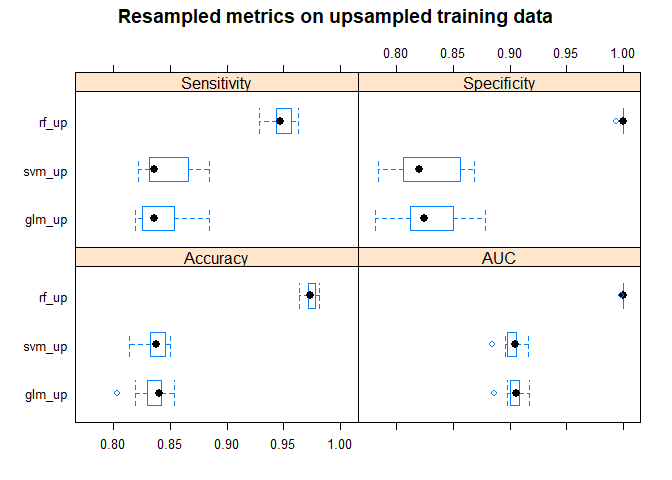<!-- -->

From the resampling results of different models, it is evident that the
random forest model has the highest accuracy metrics. Also the
confidence intervals don’t overlap. However, we know that based on the
confusion matrix with test data, the random forest model overfitted and
has low sensitivity and wasn’t able to predict the response variable
“YES” well.

Models from downsampled data

``` r
models_downsampled = list(glm_down = glm_model, rf_down = rf_model_down, svm_down = svm_model_down)
resampled_downsampled =resamples(models_downsampled)
bwplot(resampled_downsampled, metric = c('Accuracy','AUC','Sensitivity','Specificity'), 'Resampled metrics on downsampled training data')
```

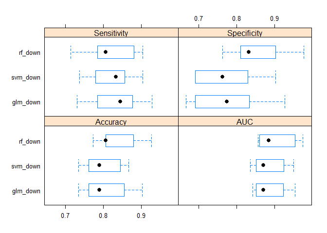<!-- -->

For downsampled training data, the models have similar metric values
with overlapping confidence interval.

#### Compare SVM and GLM

``` r
compare_models(glm_model, svm_model_down)
```

    ## 
    ##  One Sample t-test
    ## 
    ## data:  x
    ## t = 0.88465, df = 9, p-value = 0.3994
    ## alternative hypothesis: true mean is not equal to 0
    ## 95 percent confidence interval:
    ##  -0.007504174  0.017142728
    ## sample estimates:
    ##   mean of x 
    ## 0.004819277

### Best model

There is no significant difference on the resampling results from GLM
and SVM models. Therefore, it would be better to pick GLM since it is
more explainable and scalable than SVM.

When the resampling results from Random Forest model were compared with
the resampling results from the other two models, it is evident that RF
has higher accuracy metrics. The problem with RF lies more on the data
it was trained on. Even though it has high resampled accuracy, it wasn’t
able to correctly predict TRUE POSITIVES on test set.

One would choose the GLM over RF because of simplicity and accuracy.
Moreover, the test predictions are acceptable even though it predicted
more “YES”. The downside of the GLM model would be the cost of marketing
campaign for FALSE POSITIVE clients.

### Identify Important variables

``` r
plot(varImp(glm_model_up), top = 10, main = 'Top 10 important variables in the GLM')
```

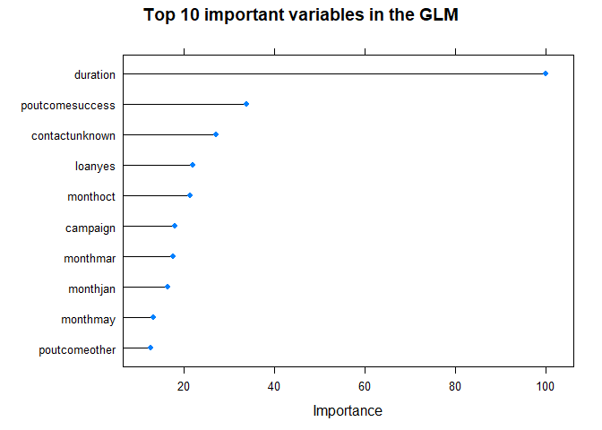<!-- -->

``` r
plot(varImp(rf_model), top = 10, main = 'Top 10 important variables in the Random Forest Model')
```

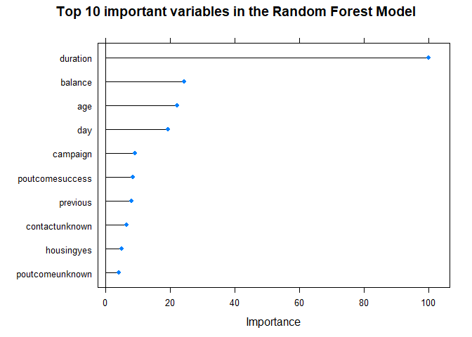<!-- -->

In both models, both the duration and poutcome access are included in
the 10 most important variables.

## IV Things to do/improve

-   More data
-   Do feature engineering on campaign variables
-   Expand tuning parameters
-   Try other models (models that can take into account class imbalance)
-   Try nonlinear models? Though probably it wont affect much.
-   Try other sampling methods to balance response variable.
-   Try other methods to account for class imbalance (weighted models,
    different probablity cutoff, etc)
-   Look into other metrics aside from accuracy.
-   Select only important variables and fit another model
