``` r
library(tidyverse)
library(lubridate)
library(ggplot2)
library(tvthemes)
library(gridExtra)
library(cowplot)
library(treemap)
library(data.table)
library(broom)
library(knitr)

theme_set(theme_minimal())
```

``` r
checkin = read_csv('dailycheckins.csv')
```

## Function to summarize data cleaning

``` r
clean_data = function(data){
        
        data = data %>%
                mutate(has_utc = str_detect(timestamp, 'UTC')) %>%
                mutate(timestamp = str_remove(timestamp,'UTC')) %>%
                mutate(has_letter = str_detect(timestamp, '[:alpha:]')) %>%
                mutate(notAMPM = str_detect(timestamp, 'AM|PM', negate =  TRUE)) %>%
                mutate(to_change = (has_letter & notAMPM)) %>%
                select(-has_letter, -notAMPM)
        
        data = data %>%
                mutate(month_russian = str_extract(timestamp, '[:alpha:]+')) %>%
                mutate(month_russian = ifelse(str_detect(month_russian, 'AM|PM'), NA, month_russian))
        
        months = data %>%
                distinct(month_russian) %>%
                filter(!is.na(month_russian))
        
        
        english_months = c('September','November','October','August', 'July','June','May','April','March','February','January','December')
        
        months$english_months = english_months
        
        data = data %>%
                left_join(months, by = c('month_russian' = 'month_russian')) %>%
                mutate(timestamp = ifelse(to_change, str_replace(timestamp,month_russian, english_months), timestamp))
        
        data = data %>%
                mutate(AMPM = str_extract(timestamp, 'AM|PM')) %>%
                mutate(timestamp = ifelse(!is.na(AMPM), str_remove(timestamp, 'AM|PM'), timestamp))
        
        data = data %>%
                mutate(fixed_timestamp = if_else(has_utc, ymd_hms(timestamp), NA_real_)) %>% #format for utc
                mutate(fixed_timestamp = if_else(to_change, dmy_hm(timestamp), fixed_timestamp)) %>%
                mutate(fixed_timestamp = if_else(!is.na(AMPM), mdy_hm(timestamp), fixed_timestamp))
        
        data = data %>%
                select(-month_russian, -english_months) %>%
                rename(has_russian = to_change)
        
        data = data %>%
                mutate(prev_entry = lead(fixed_timestamp)) %>% #create next and prev timestamp
                mutate(next_entry = lag(fixed_timestamp)) %>%
                mutate(prev_entry_diff = abs(as.duration(fixed_timestamp - prev_entry))) %>% #compute for time difference
                mutate(next_entry_diff = abs(as.duration(next_entry - fixed_timestamp))) %>% 
                mutate(big_diff = prev_entry_diff > hours(3) & next_entry_diff > hours(3)) %>% #counted big difference if both entries are 6 hrs away
                mutate(fixed_timestamp = if_else((big_diff & !is.na(AMPM) & AMPM == 'AM'), fixed_timestamp - hours(12), fixed_timestamp)) %>% #adjust time
                mutate(fixed_timestamp = if_else((big_diff & !is.na(AMPM) & AMPM == 'PM'), fixed_timestamp + hours(12), fixed_timestamp)) 
        
        data = data %>%
                select(-prev_entry, -next_entry, -next_entry_diff, -prev_entry_diff, -big_diff, -AMPM, -has_russian, -has_utc) %>%
                mutate(fixed_timestamp = fixed_timestamp + hours(8)) %>%
                rename(raw_timesstamp = timestamp) %>%
                rename(timestamp = fixed_timestamp) %>%
                select(timestamp, user, hours, project)
        
        data = data %>%
                mutate(project = str_replace(project, 'blogideas', 'blog-ideas'),
                       project = str_replace(project, '^c(.*)and(.*)','cultureandmanagement'),
                       project = str_replace(project, 'hirng','hiring'),
                       project = str_replace(project, 'internals','internal'),
                       project = str_replace(project, 'machine-learning','machinelearning'),
                       project = str_replace(project, 'misc','miscellaneous'),
                       project = str_replace(project, '^op(.*)min$','opsandadmin'),
                       project = str_replace(project, 'pm','projectmanagement'),
                       project = str_replace(project, 'workshops','workshop'))
        
        data
}

checkin = clean_data(checkin)
```

``` r
checkin %>%
        filter(duplicated(.))
```

    ## # A tibble: 804 x 4
    ##    timestamp           user    hours project             
    ##    <dttm>              <chr>   <dbl> <chr>               
    ##  1 2018-11-26 20:49:17 jorah    0.5  opsandadmin         
    ##  2 2018-11-22 22:12:32 joffrey  2    project-25          
    ##  3 2018-11-22 19:36:11 jon      1    project-25          
    ##  4 2018-11-22 19:36:11 jon      1    project-25          
    ##  5 2018-11-22 19:36:11 jon      1.75 project-25          
    ##  6 2018-11-22 18:58:01 davos    1    cultureandmanagement
    ##  7 2018-11-22 08:00:00 jorah    1    cultureandmanagement
    ##  8 2018-11-21 08:00:00 hound    1    opsandadmin         
    ##  9 2018-11-20 08:00:00 davos    0.5  project-65          
    ## 10 2018-11-20 08:00:00 jon      0.5  project-25          
    ## # ... with 794 more rows

There are 804 rows that are duplicated.

``` r
checkin = checkin %>%
        distinct()
```

``` r
checkin %>%
        mutate(month = floor_date(timestamp, 'month')) %>%
        count(month) %>%
        filter(n < 100) %>%
  kable()
```

| month      |   n |
|:-----------|----:|
| 2010-10-01 |  12 |
| 2016-06-01 |   4 |
| 2017-04-01 |   6 |
| 2017-06-01 |  51 |
| 2018-12-01 |   7 |
| 2019-09-01 |   6 |

Get july 2017 to November 2018

``` r
checkin = checkin %>%
        filter(timestamp >= '2017-07-01', timestamp< '2018-12-01')
```

Check number of logs daily

``` r
checkin %>%
        mutate(week = floor_date(timestamp, 'week')) %>%
        count(week) %>%
        filter(n > 100) %>%
        ggplot(aes(as.Date(week), n))+
        geom_line(size = 3, color = 'steelblue')+
        ylim(0, 600)+
        labs(x = '', y ='Activity Counts', title = 'Activity Logs Count', subtitle = 'Grouped by week')+
        theme_minimal()+
        scale_x_date(date_breaks = "3 month", date_minor_breaks = "1 month",  date_labels = '%b %Y')
```

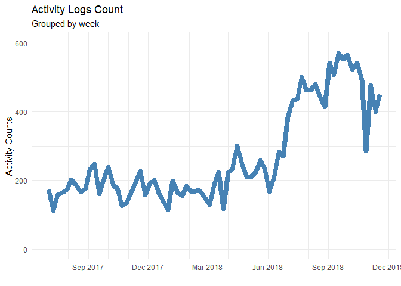
Comparing with number of distinct users and activities

``` r
user_graph = checkin %>%
        mutate(week = floor_date(timestamp, 'week')) %>%
        filter(week >= '2017-07-01') %>%
        group_by(week) %>%
        distinct(user) %>%
        add_count() %>%
        ggplot(aes(as.Date(week), n))+
        geom_line(size = 3, color = 'steelblue')+
        ylim(0,30)+
        labs(x = '', y = 'count', title = 'Number of users', subtitle = 'Grouped weekly')+
        scale_x_date(date_breaks = "3 month", date_minor_breaks = "1 month",  date_labels = '%b %y')

project_graph = checkin %>%
        mutate(week = floor_date(timestamp, 'week')) %>%
        filter(week >= '2017-07-01')  %>%
        group_by(week) %>%
        distinct(project) %>%
        add_count() %>%
        ggplot(aes(as.Date(week), n))+
        geom_line(size = 3, color = 'cyan3')+
        ylim(0, 45)+
        labs(x = '', title = 'Number of activities', y ='', subtitle = 'Grouped weekly')+
        scale_x_date(date_breaks = "3 month", date_minor_breaks = "1 month",  date_labels = '%b %y')
    


plot_grid(user_graph, project_graph, labels = c('A','B'), ncol = 2)
```

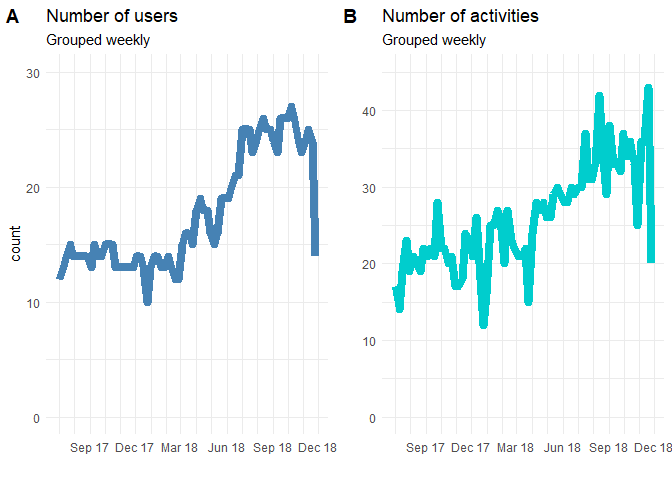

Count number of activities per user

``` r
checkin %>%
        mutate(user = fct_lump(user, 20)) %>%
        filter(!is.na(user)) %>%
        filter(user != 'Other') %>%
        count(user) %>%
        mutate(user = fct_reorder(user, n)) %>%
        arrange(desc(n)) %>%
        ggplot(aes(user, n))+
        geom_col(fill= 'steelblue')+
        coord_flip()+
        labs(y = 'Number of activities',
             title = 'Activity count by person')
```

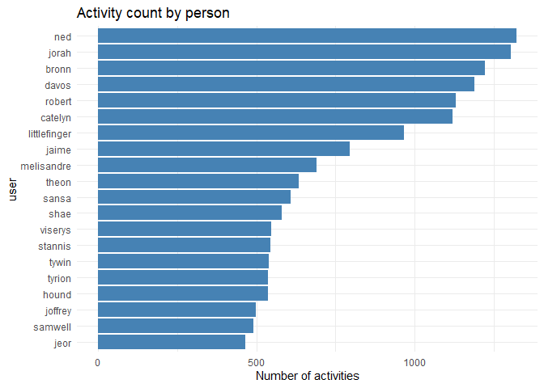

Check Ned’s activity

``` r
checkin %>%
        filter(user == 'ned') %>%
        mutate(month = floor_date(timestamp, 'month')) %>%
        mutate(project_general = ifelse(str_detect(project, '^project(.*)[:digit:]$'), 'project', project)) %>%
        mutate(project_general = fct_lump(project_general, 5)) %>%
        group_by(month, project_general) %>%
        summarise(hours_spent = sum(hours)) %>%
        ggplot(aes(as.Date(month), hours_spent, fill = reorder(project_general, hours_spent, FUN = mean)))+
        geom_col()+
        scale_fill_brewer('',palette = 'Accent')+
        guides(color = guide_legend(nrow = 1))+
        scale_x_date(date_breaks = "3 month", date_minor_breaks = "1 month",  date_labels = '%Y %b')+
        theme(legend.position = 'bottom', legend.text = element_text(size = 9),
              legend.background = element_rect(fill = 'lightblue', colour = 'darkblue'))+
        labs(x = '', y = 'hours spent', title = "Ned's monthly activity")
```

    ## `summarise()` has grouped output by 'month'. You can override using the `.groups` argument.

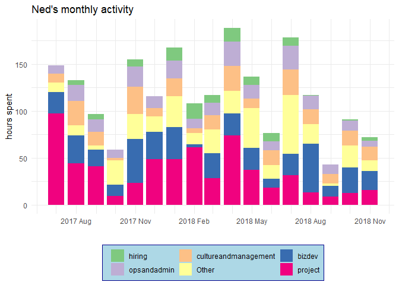

Check distribution of hours

``` r
checkin %>%
        ggplot(aes(hours))+
        geom_histogram(binwidth = 2, fill = 'cadetblue2', color = 'black')+
        labs(title = 'Distribution of hours')
```

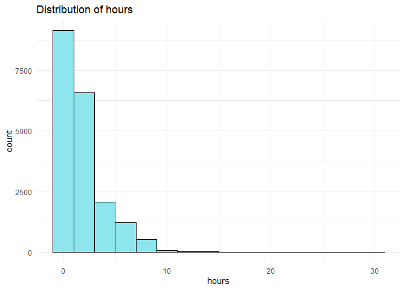
Skewed because there are numerous activities that are listed with few
hours

``` r
e1071::skewness(checkin$hours)
```

    ## [1] 1.9046

Definitely right skewed.

Remove 0 to fit transformation

``` r
bc = caret::BoxCoxTrans(checkin[checkin$hours !=0,]$hours)

hours = checkin[checkin$hours !=0,]$hours
hours_transformed = predict(bc, hours)
```

Can transform if needed

``` r
hist(hours_transformed, col = 'steelblue', main = 'Hours transformed')
```


Or just check the the distribution of total hours daily

``` r
checkin %>%
        mutate(day_date = round(timestamp, 'day')) %>%
        group_by(user, day_date) %>%
        summarise(total_hours = sum(hours)) %>%
        ggplot(aes(total_hours))+
        geom_histogram(fill = 'steelblue', color = 'black', binwidth = 1)+
        labs(title = 'Distribution of daily working hours',
             x = 'hours',
             y = 'count')+
        scale_x_continuous(breaks = seq(0, 40, by =  4))
```

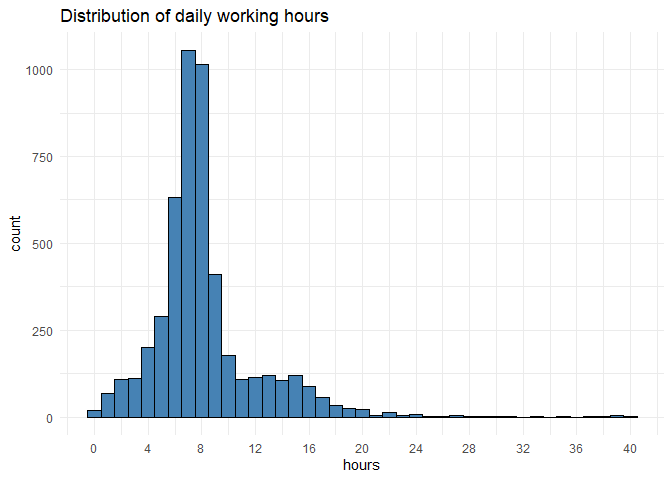

Right skewed and centered around 8

``` r
checkin %>% 
        mutate(user = fct_lump(user, 16)) %>%
        filter(!is.na(user), user != 'Other') %>%
        mutate(day = round(timestamp, 'day')) %>%
        group_by(user, day) %>%
        summarise(total_hours_day = (sum(hours)),
                  n = n()) %>%
        ggplot(aes(reorder(user,total_hours_day, FUN = median), total_hours_day))+
        geom_boxplot(fill = 'cyan3')+
        coord_flip()+
        labs(x = '',
             y = 'Daily Hours Spent',
             title = 'Distribution of daily working hours per user')
```

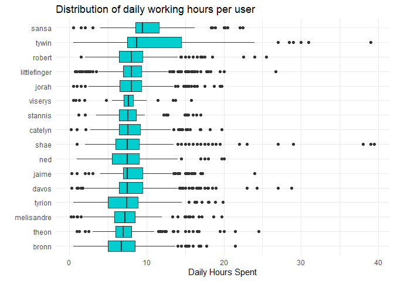

The distribution is centered around 8 hours. However, there are people
who worked for more than 24 hours per day.

``` r
checkin %>% 
        mutate(user = fct_lump(user, 16)) %>%
        filter(!is.na(user), user != 'Other') %>%
        mutate(day = round(timestamp, 'day')) %>%
        group_by(user, day) %>%
        summarise(total_hours = sum(hours)) %>%
        filter(total_hours > 16) %>%
        arrange(desc(total_hours)) %>%
        count(user) %>% 
        ggplot(aes(reorder(user, n), n))+
        geom_col(fill = 'cyan3')+
        coord_flip()+
        labs(x = '', y ='Occurences', title = 'Count of working hours > 16 hrs')
```

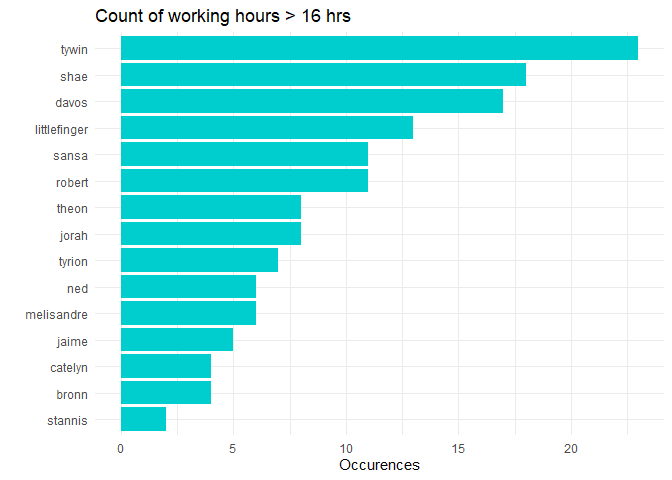

Shae and tywin must be really hard working

Im interested on the check-in hours. What time do users usually login?

``` r
checkin %>%
        mutate(rounded_time = round_date(timestamp, 'hour')) %>%
        mutate(hour_login = hour(rounded_time)) %>%
        distinct(rounded_time, hour_login, user) %>%
        group_by(hour_login) %>%
        count() %>%
        ggplot(aes(hour_login, n))+
        geom_col(fill = 'cyan3', color = 'black')+
        labs(x = 'Hour', y = 'Logins', title = 'Count of check-ins by hour')+
        scale_x_continuous(breaks = c(0,4,8,12,16,20), labels = function(x) paste(x,':00'))
```

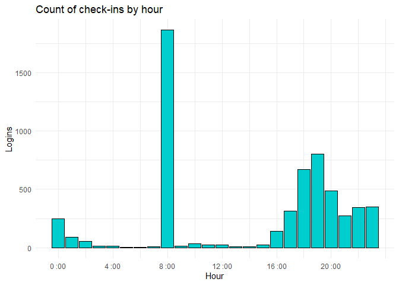

As expected, most of the login occurs at 8 am. After 4 pm, the login
time varies

Try to find night shift and day shift people

``` r
shifts = checkin %>%
        mutate(rounded_timestamp = round_date(timestamp, 'hour')) %>%
        mutate(checkin_hour = hour(rounded_timestamp)) %>%
        mutate(day_shift = checkin_hour >= 4 & checkin_hour < 16)%>%
        mutate(night_shift = checkin_hour >= 16 | checkin_hour <4) %>%
        mutate(shift = ifelse(day_shift,'DAY','NIGHT')) %>%
        group_by(user) %>%
        mutate(shift_user = ifelse(all(shift == 'NIGHT'), 'NIGHT', NA)) %>%
        mutate(shift_user = ifelse(all(shift == 'DAY'), 'DAY',shift_user)) %>%
        mutate(shift_user = ifelse(is.na(shift_user), 'SHIFTING', shift_user)) %>%
        distinct(shift_user, user)

shifts %>%
  ungroup() %>%
  filter(!is.na(user)) %>%
  group_by(shift_user) %>%
  summarise(users = paste0(user, collapse = ', ')) %>%
  rename(shift = shift_user) %>%
  kable()
```

| shift    | users                                                                                                                                                                                                                                                                                             |
|:---------|:--------------------------------------------------------------------------------------------------------------------------------------------------------------------------------------------------------------------------------------------------------------------------------------------------|
| NIGHT    | daario, missandei, tommen                                                                                                                                                                                                                                                                         |
| SHIFTING | catelyn, cersei, daenerys, jorah, viserys, jaime, ned, jon, sansa, arya, robb, theon, bran, joffrey, hound, tyrion, khal, littlefinger, davos, samwell, stannis, robert, melisandre, jeor, bronn, varys, shae, margaery, tywin, talisa, ygritte, gendry, tormund, brienne, ramsay, gilly, ellaria |

3 with strict night shift. All others are shifting

Check project/activities

``` r
checkin %>%
        mutate(project_general = ifelse(str_detect(project, '^project(.*)[:digit:]$'), 'project', project)) %>%
        count(project_general) %>%
        arrange(desc(n)) %>%
        head(10) %>%
        ggplot(aes(reorder(project_general,n), n))+
        geom_col(fill = 'cyan3')+
        coord_flip()+
        labs(x = '', y = 'activity count', title = 'Ten most logged activities')
```

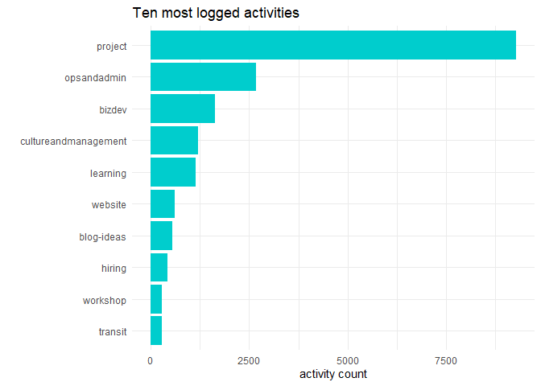

Hours spent on project per month

``` r
checkin %>%
        mutate(project_general = ifelse(str_detect(project, '^project(.*)[:digit:]$'), 'project', project)) %>%
        filter(project_general == 'project') %>%
        mutate(project = fct_lump(project, 10, other_level =  'Other project')) %>%
        mutate(month = floor_date(timestamp, 'month')) %>%
        group_by(month, project) %>%
        summarise(total_hours = sum(hours)) %>%
        filter(month > '2018-01-01', month < '2018-12-01') %>%
        ggplot(aes(month, total_hours, fill = project))+
        geom_bar(position =  'stack', stat = 'identity') +
        labs(fill = '', x = '', y = 'total hours spent', title = 'Total hours spent on a project by month')+
        scale_fill_brewer(palette = 'Set3')+
        theme_minimal()
```

    ## `summarise()` has grouped output by 'month'. You can override using the `.groups` argument.

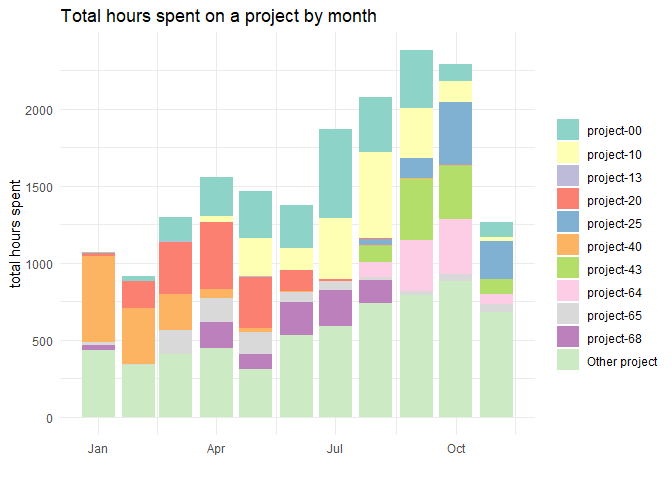

Can see the trend of total working hours spent per project. Can see when
the project starts and when it ends, but not looks very noisy

User and project

Check project with the most hours

``` r
hours_spent_project = checkin %>%
        mutate(project_general = ifelse(str_detect(project, '^project(.*)[:digit:]$'), 'project', project)) %>%
        filter(project_general == 'project') %>%
        mutate(project = fct_lump(project, 8, other_level ='Other 67 projects')) %>%
        group_by(project) %>%
        summarise(total_hours = sum(hours))

hours_spent_project = hours_spent_project %>%
        mutate(fraction = total_hours/sum(total_hours))

hours_spent_project$ymax = cumsum(hours_spent_project$fraction) - .005

hours_spent_project$ymin = c(0, head(hours_spent_project$ymax, n=-1))

hours_spent_project$labelPosition <- (hours_spent_project$ymax + hours_spent_project$ymin) / 2

hours_spent_project$label <- paste0(hours_spent_project$project, "\n value: ", hours_spent_project$total_hours, ' hrs')

ggplot(hours_spent_project, aes(ymax=ymax, ymin=ymin, xmax=4, xmin=3, fill=project)) +
        geom_rect() +
        geom_label( x=3.5, aes(y=labelPosition, label=label), size=3) +
        scale_fill_brewer(palette= 'Set3') +
        coord_polar(theta="y") +
        xlim(c(2, 4)) +
        theme_void()+
        theme(legend.position = "none")+
        labs(title = 'Total hours spent by project')
```

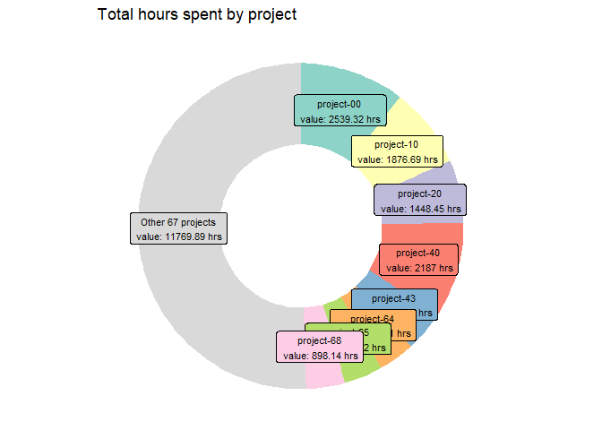

Check the contributors for project 00

``` r
project_00_contributors = checkin %>%
        filter(project == 'project-00') %>%
        mutate(user = fct_lump(user, 10)) %>%
        group_by(user) %>%
        summarise(total_hours = sum(hours)) %>%
        arrange(desc(total_hours))

treemap(project_00_contributors, index = 'user', vSize = 'total_hours', type = 'index', title = 'Project 00 Contributors', palette = 'Set3', fontsize.labels = 10)
```


Try to group activities and compare activity by hours

``` r
checkin = checkin %>%
        mutate(project_general = ifelse(str_detect(project, '^project(.*)[:digit:]$'), 'project', project)) %>%
        mutate(project_general = fct_collapse(project_general,
                                              'blog' = c('blogpost','blog-ideas'),
                                              'learning' = c('d3js','learning','machinelearning','onboarding','pandas','sqool',
                                                           'strategy','weeklygoals','braintooling','qgis','dataethics'),
                                              'management' = c('cultureandmanagement','events','hiring','interns','internal','recruitment','security','workshop'),
                                              'marketing' = c('branding','marketing','media','finance','paperwork','products', 'transit','legal'),
                                              'development' = c('website','data','datastrategy','debugging','engineering','datastorytelling','bizdev','design'),
                                              'project' = c('project','projectmanagement'))) %>%
        mutate(project_general = fct_lump(project_general, 7))

checkin %>%
        ggplot(aes(reorder(project_general, hours, FUN = median), hours))+
        geom_boxplot(fill = 'cyan3')+
        coord_flip()+
        labs(x = '', y = 'hours', title = 'Distribution of hours by activity')
```

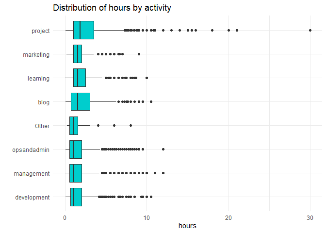
Try to remove outliers

``` r
checkin %>%
        group_by(project_general) %>%
        filter(!(abs(hours - median(hours) > 2 *sd(hours)))) %>%
        ggplot(aes(reorder(project_general, hours, FUN = median), hours))+
        geom_boxplot(fill = 'cyan3')+
        coord_flip()+
        labs(x = '', y = 'hours', title = 'Distribution of hours by activity', caption = 'outliers removed')
```

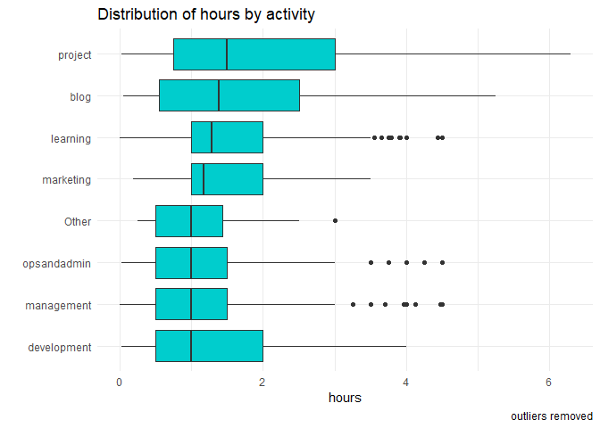

Even when outliers are removed, project activities are still the most
time consuming, followed by blogging and learning..

Check general task per user

``` r
checkin %>%
        distinct(user, project_general) %>%
        filter(!is.na(user)) %>%
        group_by(user) %>%
        mutate(task = paste0(project_general, collapse = ' , '),
               number_of_tasks = n()) %>%
        select(-project_general) %>%
        distinct() %>%
        arrange(desc(number_of_tasks)) %>%
  kable()
```

| user         | task                                                                                   | number_of_tasks |
|:-------------|:---------------------------------------------------------------------------------------|----------------:|
| jorah        | project , marketing , opsandadmin , learning , development , blog , management , Other |               8 |
| ned          | project , management , learning , marketing , opsandadmin , development , Other , blog |               8 |
| sansa        | project , marketing , development , management , learning , opsandadmin , blog , Other |               8 |
| robb         | development , project , management , learning , opsandadmin , blog , marketing , Other |               8 |
| theon        | project , development , opsandadmin , management , blog , learning , marketing , Other |               8 |
| joffrey      | project , management , development , learning , opsandadmin , blog , Other , marketing |               8 |
| hound        | marketing , opsandadmin , blog , management , Other , learning , project , development |               8 |
| tyrion       | project , blog , development , learning , opsandadmin , management , marketing , Other |               8 |
| davos        | management , project , blog , opsandadmin , learning , development , marketing , Other |               8 |
| robert       | project , development , management , opsandadmin , marketing , learning , blog , Other |               8 |
| bronn        | project , development , opsandadmin , learning , management , blog , marketing , Other |               8 |
| margaery     | opsandadmin , project , learning , Other , development , management , blog , marketing |               8 |
| catelyn      | opsandadmin , management , project , development , marketing , blog , learning         |               7 |
| cersei       | blog , project , management , learning , opsandadmin , marketing , development         |               7 |
| daenerys     | blog , project , management , learning , opsandadmin , development , marketing         |               7 |
| viserys      | project , opsandadmin , blog , learning , management , development , marketing         |               7 |
| khal         | project , learning , opsandadmin , management , blog , marketing , development         |               7 |
| littlefinger | management , opsandadmin , blog , marketing , development , learning , project         |               7 |
| stannis      | development , project , learning , blog , management , opsandadmin , marketing         |               7 |
| jeor         | project , development , opsandadmin , learning , management , marketing , blog         |               7 |
| varys        | management , project , opsandadmin , learning , blog , marketing , development         |               7 |
| shae         | project , management , opsandadmin , development , marketing , learning , Other        |               7 |
| tywin        | development , management , opsandadmin , learning , project , blog , marketing         |               7 |
| gendry       | development , management , marketing , project , opsandadmin , learning , Other        |               7 |
| jaime        | learning , project , opsandadmin , management , development , marketing                |               6 |
| bran         | project , learning , development , management , Other , blog                           |               6 |
| samwell      | project , development , learning , marketing , management , opsandadmin                |               6 |
| melisandre   | project , opsandadmin , learning , management , development , marketing                |               6 |
| talisa       | blog , opsandadmin , development , learning , project , management                     |               6 |
| ygritte      | opsandadmin , development , management , project , marketing , learning                |               6 |
| brienne      | management , opsandadmin , Other , development , learning , project                    |               6 |
| ramsay       | project , learning , development , opsandadmin , management , marketing                |               6 |
| gilly        | project , development , management , opsandadmin , blog , learning                     |               6 |
| jon          | project , blog , learning , management , opsandadmin                                   |               5 |
| arya         | project , learning , management , blog , development                                   |               5 |
| missandei    | project , management , learning , opsandadmin , development                            |               5 |
| tormund      | opsandadmin , project , learning , management                                          |               4 |
| daario       | project , management , development , opsandadmin                                       |               4 |
| tommen       | project , management , Other                                                           |               3 |
| ellaria      | opsandadmin , project                                                                  |               2 |

Try to model hours using project

``` r
checkin %>%
        group_by(project_general) %>%
        filter(!(abs(hours - median(hours) > 2 *sd(hours)))) %>%
        summarise(mean_hours = mean(hours),
                  median_hours = median(hours)) %>%
        kable()
```

| project_general | mean_hours | median_hours |
|:----------------|-----------:|-------------:|
| development     |   1.397298 |        1.000 |
| blog            |   1.730295 |        1.385 |
| learning        |   1.597903 |        1.280 |
| marketing       |   1.399790 |        1.170 |
| management      |   1.285479 |        1.000 |
| opsandadmin     |   1.140140 |        1.000 |
| project         |   2.033336 |        1.500 |
| Other           |   1.081034 |        1.000 |

``` r
hours_conf_int = checkin %>%
        mutate(hours_date = hour(timestamp),
               month_date = month(timestamp)) %>%
        select(-timestamp) %>%
        group_by(project_general) %>%
        filter(!(abs(hours - median(hours) > 2 *sd(hours)))) %>%
        nest(-project_general) %>%
        mutate(model = map(data, ~t.test(.$hours)),
               tidied = map(model, tidy)) %>%
        unnest(tidied)

hours_conf_int %>%
         ggplot(aes(estimate, reorder(project_general, estimate)))+
        geom_point()+
        geom_errorbarh(aes(xmin = conf.low, xmax = conf.high))+
         labs(
            x  = 'Average hours', 
            y = 'Activity',
            title = 'Average hours of activity'
        )
```

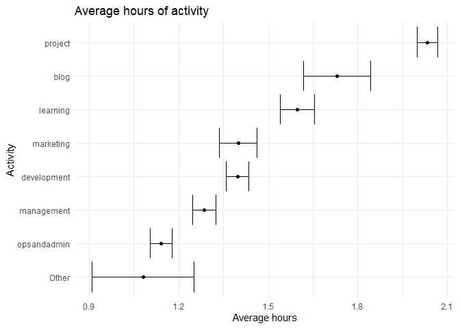

As expected, doing Others will result to higher variation in working
hours. Project definitely consumes more time compared to other
activities.

Project might be a good predictor for average hours

``` r
hours_project = checkin %>%
  select(-timestamp, -project, -user)

hours_project = hours_project %>%
  mutate(mean_hours = mean(hours)) %>%
  mutate(hours_compared = hours - mean_hours)

lm_mod = lm(hours ~ project_general, hours_project)

summary(lm_mod)
```

    ## 
    ## Call:
    ## lm(formula = hours ~ project_general, data = hours_project)
    ## 
    ## Residuals:
    ##     Min      1Q  Median      3Q     Max 
    ## -2.4959 -1.2659 -0.6069  0.4841 27.4841 
    ## 
    ## Coefficients:
    ##                            Estimate Std. Error t value Pr(>|t|)    
    ## (Intercept)                 1.73728    0.03734  46.529  < 2e-16 ***
    ## project_generalblog         0.44224    0.09206   4.804 1.57e-06 ***
    ## project_generallearning     0.16216    0.06676   2.429   0.0152 *  
    ## project_generalmarketing   -0.13305    0.08889  -1.497   0.1344    
    ## project_generalmanagement  -0.06342    0.05569  -1.139   0.2548    
    ## project_generalopsandadmin -0.13035    0.05354  -2.435   0.0149 *  
    ## project_generalproject      0.77862    0.04261  18.272  < 2e-16 ***
    ## project_generalOther       -0.24958    0.24871  -1.004   0.3156    
    ## ---
    ## Signif. codes:  0 '***' 0.001 '**' 0.01 '*' 0.05 '.' 0.1 ' ' 1
    ## 
    ## Residual standard error: 1.982 on 19607 degrees of freedom
    ## Multiple R-squared:  0.0408, Adjusted R-squared:  0.04046 
    ## F-statistic: 119.1 on 7 and 19607 DF,  p-value: < 2.2e-16

Blogging and project have significant positive coefficient. There is
also a significant difference between these variables compared to
development. Can be interpreted as having a higher working hours when
doing blogging or project compared to the baseline variable,
development.
